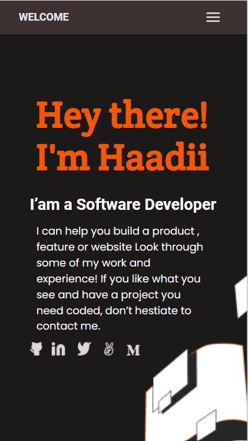
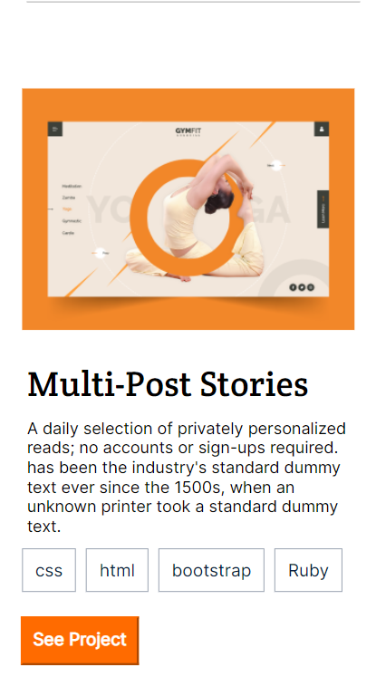
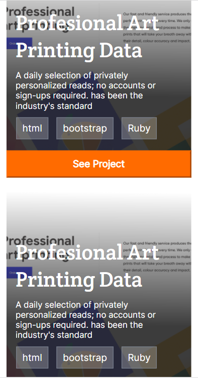
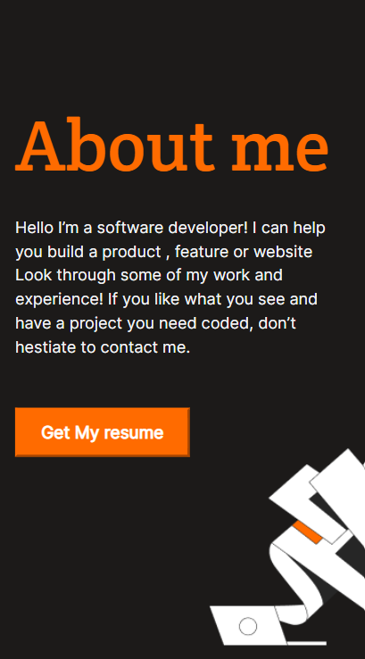
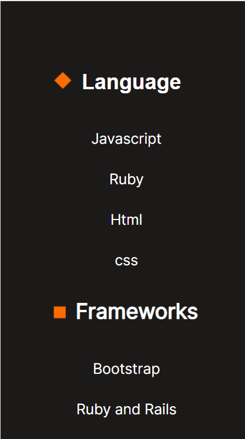
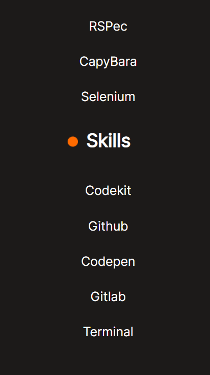

# Portfolio-project

This is a single-page portfolio website with a header, work section, about section, and contact section which was parsed from Microverse Figma Template 1. The webpage is responsive and can be used on different screens. The contact section and all animation effects the portfolio was done by all the three authors listed below as contributing authors. This project was made with HTML, CSS and javascript linters and proper Github Flow was used. Javascript was used to toggle the mobile menu. The Personal-portfolio website has been deployed using github pages, the link is below.

## Objectives

Understand how to create UIs adaptable to different screen sizes using media queries.
Understand how to parse a Figma design to create a UI
Use of flexbox to place elements in the page
use of images and background to enhance the appearance
Prepare a repository for development using linters
Ensure there are no linter errors
Use of meaningful commit messages
Descriptive README files
Descriptive pull request title and a summary explaining changes inside
Branch names should describe actions taken
Follow best practices for HTML and CSS
Deploy the website online using github pages

## Built With

- HTML
- CSS
- JS

## Getting Started
To get a local copy up and running follow these simple example steps:
## prerequisites
-must have git installed.
## setup
- git clone https://github.com/Haadiiii/my-portfolio
- cd my-portfolio

## Authors

👤 **Author**

- GitHub: [@Haadiiii](https://github.com/Haadiiii)
- Twitter: [@HaaDiii_99](https://twitter.com/HaaDiii_99)
- LinkedIn: [LinkedIn](https://www.linkedin.com/in/hamid-ali-01a872213/)

## LIVE DEMO
[my portfolio](https://haadiiii.github.io/my-portfolio/)

## SCREENSHOTS

## 🤝 Contributing

Contributions, issues, and feature requests are welcome!

1. Fork the Project
2. Create your Feature Branch (`git checkout -b 'branchname`)
3. Commit your Changes (`git commit -m 'Add some branchname'`)
4. Push to the Branch (`git push origin branchname`)
5. Open a Pull Request

Feel free to check the [issues page](../../issues/).

## Show your support

Give a ⭐️ if you like this project!

## Acknowledgments

* [Choose an Open Source License](https://choosealicense.com)
* [GitHub Emoji Cheat Sheet](https://www.webpagefx.com/tools/emoji-cheat-sheet)
* [Malven's Flexbox Cheatsheet](https://flexbox.malven.co/)
* [Malven's Grid Cheatsheet](https://grid.malven.co/)
* [Img Shields](https://shields.io)
* [GitHub Pages](https://pages.github.com)
* [Font Awesome](https://fontawesome.com)

## 📝 License

This project is [MIT](./MIT.md) licensed.
